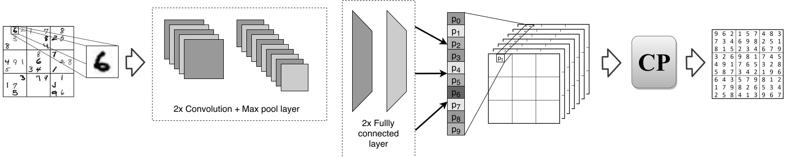

# Overview



This repository contains code for the paper:

Mulamba, M., Mandi, J., Canoy, R., & Guns, T. (2020, September). Hybrid classification and reasoning for image-based constraint solving. In International Conference on Integration of Constraint Programming, Artificial Intelligence, and Operations Research (pp. 364-380). Springer, Cham.

```latex
@inproceedings{mulamba2020hybrid,
  title={Hybrid classification and reasoning for image-based constraint solving},
  author={Mulamba, Maxime and Mandi, Jayanta and Canoy, Rocsildes and Guns, Tias},
  booktitle={International Conference on Integration of Constraint Programming, Artificial Intelligence, and Operations Research},
  pages={364--380},
  year={2020},
  organization={Springer}
}
```

Neural Networks are implemented in PyTorch.

We use the CP-SAT solver from OR-Tools and its python API for constraint solvers. [An implementation in CPMpy is also available](https://github.com/CPMpy/cpmpy/blob/master/examples/advanced/visual_sudoku.ipynb).


## Requirements

Make sure to have all required packages installed:

```bash
pandas
numpy
scipy
ortools
torch
torchvision
tqdm
```

## Dataset

Download and extract  the [Sudoku dataset](https://powei.tw/sudoku.zip)

```bash
wget -cq powei.tw/sudoku.zip && unzip -qq sudoku.zip 
```

or simply run the `get_data.sh` script.

## Run

1. Run `mnist.py` with `--save` to train a (un)calibrated CNN on MNIST (set `--help` for more info)
2. Run `viz_sudoku.py` to solve visual sudokus (with `--help` for more info)